<p align="center"><b>English</b> · <a href="README.ru.md">Русский</a> · <a href="README.technical.md">Technical (EN)</a> · <a href="README.technical.ru.md">Техническое (RU)</a></p>

<p align="center"><code>1.2.5-beta</code></p>

---

# swgPanel

**Easy-to-use self-hosted WireGuard & AmneziaWG control panel with TURN-PROXY support. Deploy your own VPN in minutes.**

swgPanel is a control panel for running your own WireGuard / AmneziaWG VPN across one or more servers.
You add your people in the browser, hand them a QR code, and they’re connected. Everything — who has
access, which servers they use, how much they’re using — lives on one dashboard that you host yourself.

Run it for yourself, your household, your team, or a whole community — a fast private VPN with no monthly
subscription and no one else sitting in the middle of your traffic.

> This is a complete, plain-language guide — enough to install swgPanel and use it even if you’re not
> technical. If you *are* technical and want the internals — architecture, every flag, the API, security —
> read the **[Technical guide](README.technical.md)**.

<p align="center">
  <a href="screenshots/overview.png">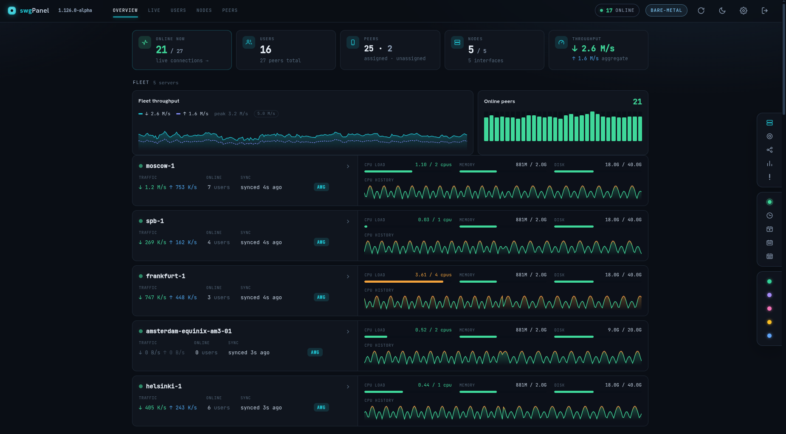</a>
  <a href="screenshots/flow-map.png">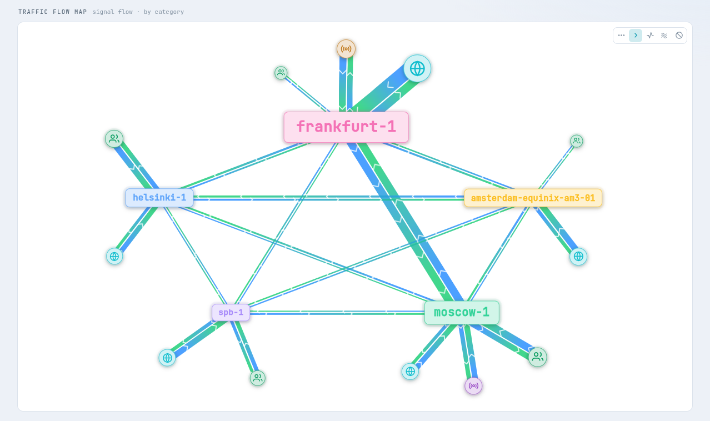</a>
  <a href="screenshots/distribution.png">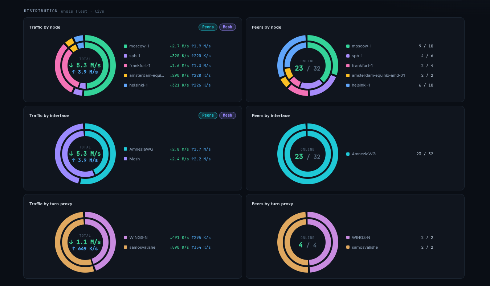</a>
  <a href="screenshots/live-users.png">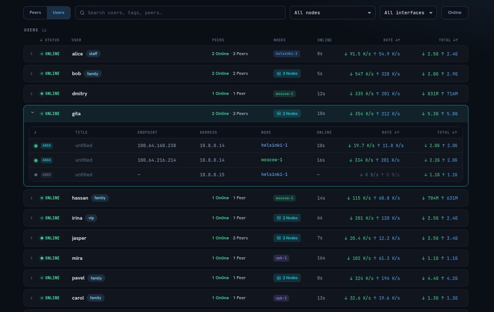</a>
  <a href="screenshots/top-charts.png">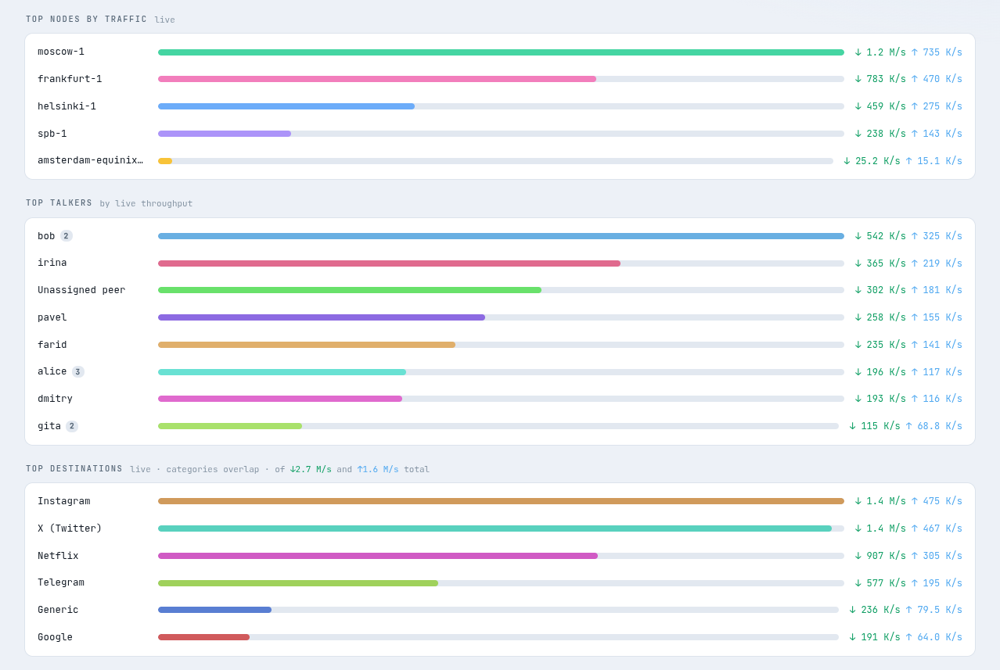</a>
  <a href="screenshots/node.png">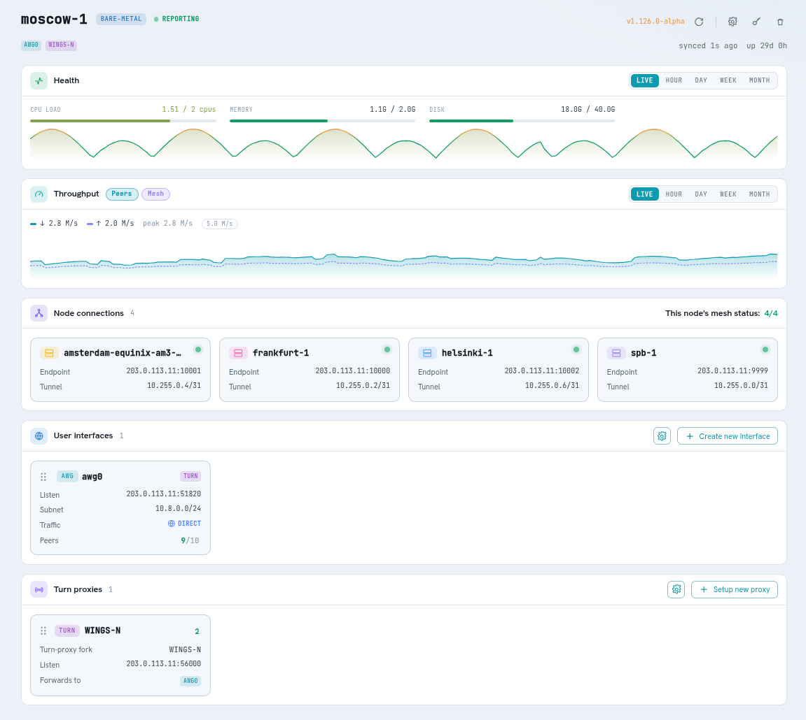</a>
</p>

<p align="center"><sub>Click any tile to enlarge · more screenshots throughout this guide</sub></p>

## Contents

- [What it does](#what-it-does)
- [Before you begin](#before-you-begin)
- [The three roles (in plain words)](#the-three-roles-in-plain-words)
- [Step 1 — Install the panel](#step-1--install-the-panel)
- [Step 2 — Add your servers](#step-2--add-your-servers)
- [Step 3 — Add people and hand out access](#step-3--add-people-and-hand-out-access)
- [Using it day to day](#using-it-day-to-day)
- [Keeping it running](#keeping-it-running) — updates, backups, recovery, switching method, uninstall
- [A few things worth knowing](#a-few-things-worth-knowing)
- [Learn more](#learn-more)

## What it does

- **One page to run everything.** Add servers, add people, hand out access — all from the web panel.
- **Access in a QR code.** Create a person, show them the QR, they scan it in the WireGuard/AmneziaWG app — no fiddly config files to email around.
- **See what’s happening, live.** Who’s online, how much they’re downloading, which servers are busy — updated every few seconds.
- **More than one server.** Put servers in different countries; a person can fail over between them.
- **Hard to block.** Uses **AmneziaWG** (a stealthier WireGuard) and can route traffic cleverly by
  destination, so it keeps working where plain VPNs get blocked.
- **You’re in control.** It’s self-hosted, stores no passwords or keys it doesn’t need, and never phones home.

<details>
<summary>📸 <b>More screenshots</b> — click to expand</summary>

| | |
|---|---|
| **People** — everyone you’ve given access to, at a glance | 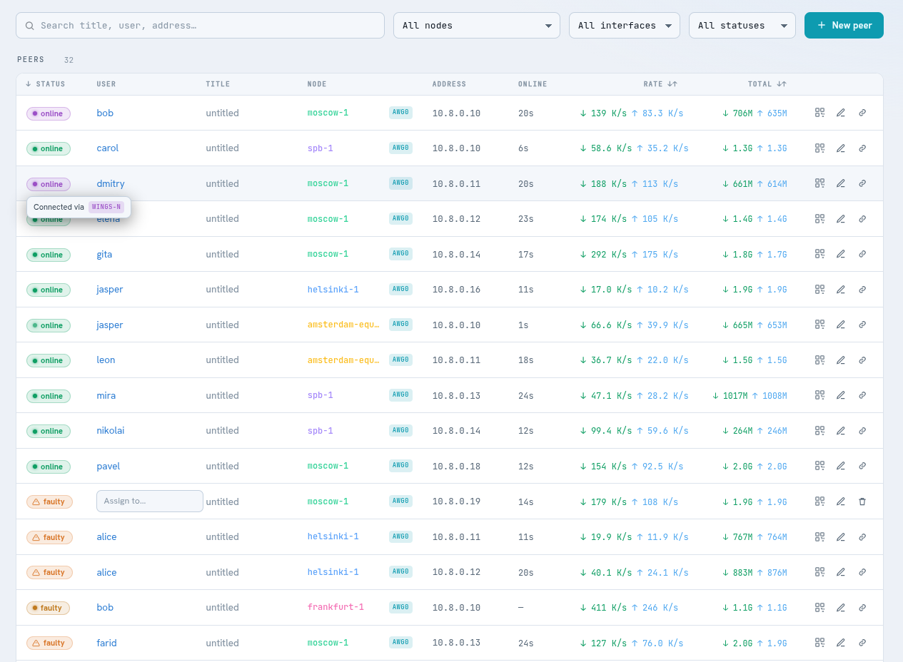 |
| **Activity log** — every change, and anything that needs attention | 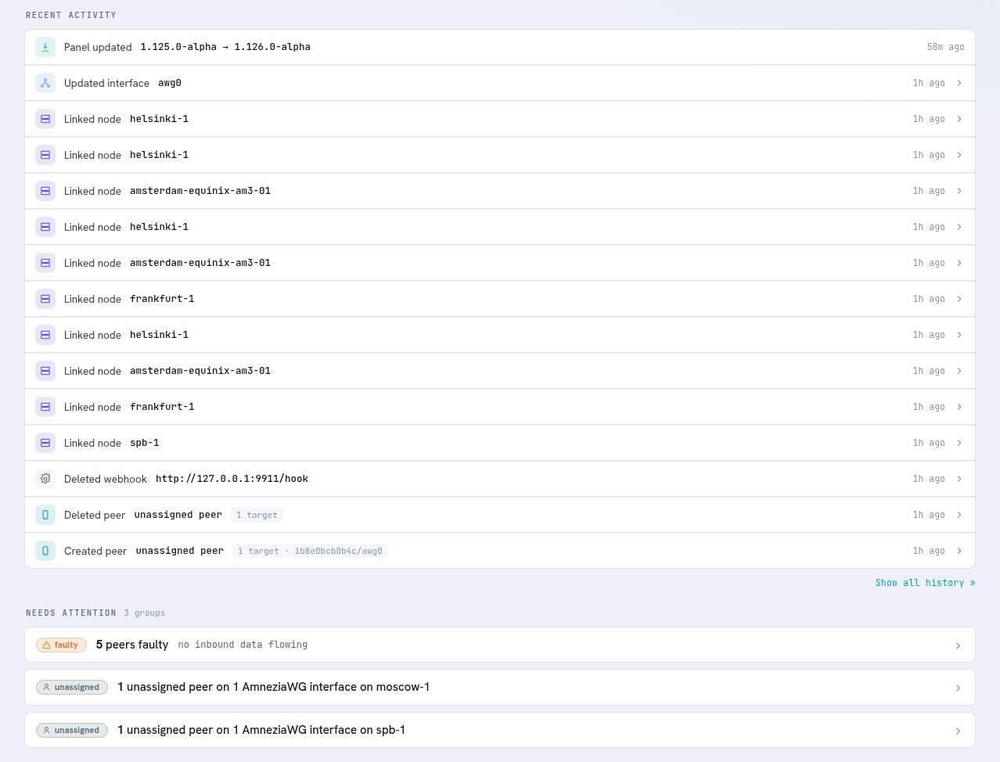 |
| **Smart routing** — send chosen sites out through a chosen server | 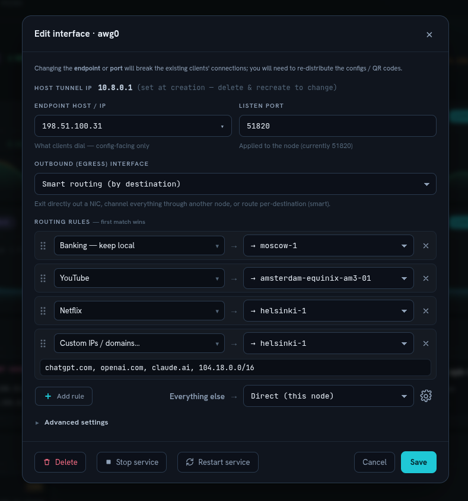 |
| **Routing lists** — pick a routing mode and manage lists per server | 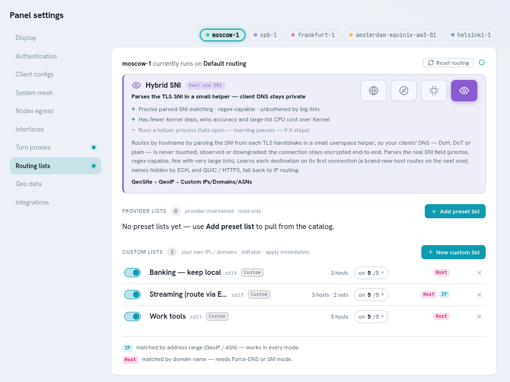 |
| **List providers** — curated + community geo/domain lists | 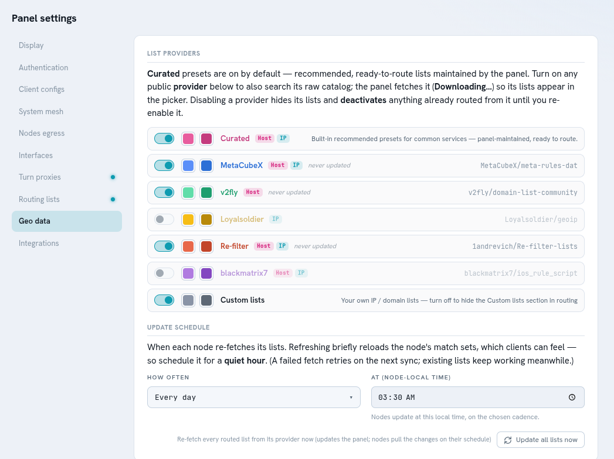 |
| **Turn-proxy** — wrap traffic through relays to beat blocks | 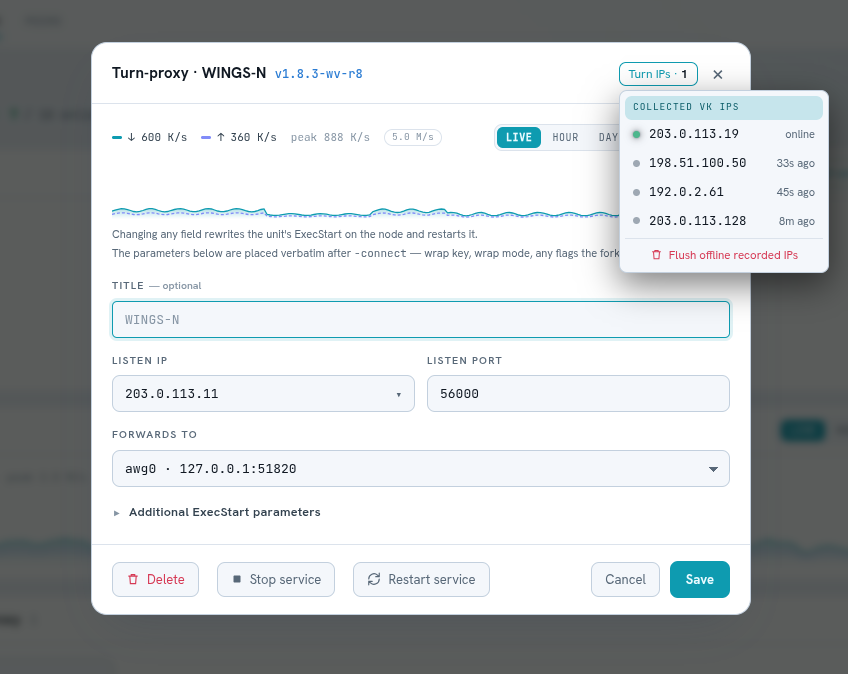 |
| **Turn-proxy catalog** — which relay forks are offered, and auto-updates | 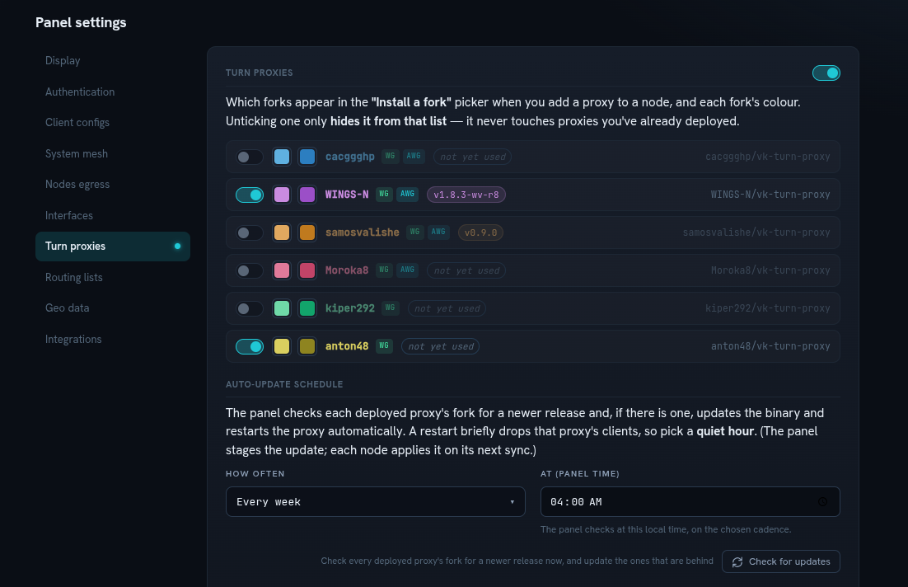 |

</details>

## Before you begin

You need **one server** to run the panel on — a cheap VPS (virtual server) from any hosting provider is
plenty. It should have:

- A **public IP address** (so your people can reach it).
- A recent **Linux** (Ubuntu/Debian and most others are fine).
- **`sudo`/root** access, and a way to paste a command into it (SSH).

That’s it. If you want a domain name (like `vpn.example.com`) you can point it at the server first — the
installer will get a real HTTPS certificate for it automatically. No domain? It still works with the
server’s IP address.

You can add **more servers** later — each extra server is one more command, run the same way.

## The three roles (in plain words)

Every server you set up plays one of three roles. You don’t have to memorise these — the installer asks
you in plain language — but it helps to know the words:

- **Host** — *just the control panel.* The web page and the brains. It doesn’t carry any VPN traffic itself.
- **Master** — *the control panel **and** a VPN server on the same box.* Simplest for a one-server setup:
  one command gives you the panel and your first VPN server together.
- **Node** — *just a VPN server.* An extra server that carries traffic and reports back to your panel.

And there are **two ways** to install any of them — pick whichever you like:

- **Bare-metal** — installs straight onto the server (a little faster).
- **Docker** — runs in containers (tidy, easy to move around).

You can mix freely: a Docker panel with bare-metal servers, and so on.

## Step 1 — Install the panel

Copy the command onto your server and run it. It **asks you a few simple questions** (is this just the
panel or also a VPN server? what domain? pick a password) and sets everything up, including HTTPS.

**Bare-metal:**
```
curl -fsSL https://raw.githubusercontent.com/SanityProtocol/swg-panel/main/bootstrap.sh | sudo bash -s host
```

**Docker:**
```
curl -fsSL https://raw.githubusercontent.com/SanityProtocol/swg-panel/main/bootstrap.sh | sudo bash -s docker host
```

The first question is the role: choose **Master** to make this box your panel *and* your first VPN server
in one go (recommended if you only have one server), or **Host** for just the panel. Either way, when it
finishes it prints your panel’s web address and login — open it and sign in.

> Prefer to install Docker yourself and use `docker compose`? That works too — see the
> [Technical guide](README.technical.md#docker).

## Step 2 — Add your servers

If you chose **Master** above, you already have your first VPN server — you can skip to Step 3. To add
**more** servers (called **nodes**), do this for each one:

1. In the panel, open **Nodes → Add node**. It shows you a ready-to-paste command with a key already
   filled in — one for bare-metal, one for Docker. It looks like this:

   ```
   curl -fsSL https://raw.githubusercontent.com/SanityProtocol/swg-panel/main/bootstrap.sh | sudo bash -s node        # bare-metal
   curl -fsSL https://raw.githubusercontent.com/SanityProtocol/swg-panel/main/bootstrap.sh | sudo bash -s docker node # Docker
   ```

2. Run that command on the new server. It asks for your panel’s address and the key (both pre-filled if
   you copied the panel’s command), then connects itself back to the panel.

The new server reaches out to the panel on its own — **you never have to open special access to it**,
no inbound ports, no SSH keys shared around. Within a few seconds it shows up in your Nodes list.

## Step 3 — Add people and hand out access

1. Go to **Peers → New peer**, give it a name (e.g. a person or a device), and pick which server(s) it
   may use.
2. The panel shows a **QR code and a config file**. The person opens the **WireGuard** or **AmneziaWG**
   app on their phone/computer, scans the QR (or imports the file), and they’re online.

That’s the whole flow. The secret half of their key is created in your browser and shown **once** — so
save/hand over the config there and then. Need to give the same person a second device? Just make another
peer.

## Using it day to day

- **Watch the dashboard.** The **Overview** page shows who’s online, the busiest servers, and where
  traffic is going — all live.
- **Add or remove people anytime.** Changes reach your servers within seconds. Remove someone and their
  access stops on the next check-in.
- **Change the panel’s login** under **⚙︎ → Account** — it takes effect immediately.
- **Route certain sites through a certain country (optional).** For example, send streaming out through a
  server abroad and keep everything else local. Set it per server under **Settings → Routing lists**.
- **Get past tougher blocks (optional).** If plain VPN traffic is blocked on a network, swgPanel can wrap
  it through a **turn-proxy** — set up under a server’s details and in **Settings → Turn proxies**.
- **Feed other tools (optional).** The panel can share live status with dashboards like **Grafana** or
  **Uptime Kuma**, and ping a webhook when a server goes offline — **Settings → Integrations**.

## Keeping it running

Everything below is **one command**, run on the server, the same way you installed. Each one **asks
before it does anything** and keeps your data safe.

### Update to the latest version

Run this on any server (panel or VPN server) — it figures out what’s installed and updates it in place,
keeping all your settings and people:
```
curl -fsSL https://raw.githubusercontent.com/SanityProtocol/swg-panel/main/bootstrap.sh | sudo bash -s update
```

### Backups — automatic, and manual

- **Automatic.** Every time something changes — you add a person, add a server, change a setting — the
  panel writes a **timestamped backup** of that file right next to it, and keeps the **last several**. If a
  file ever gets damaged (a bad shutdown, a full disk), the panel **quietly restores the newest good backup
  on its own** the next time it starts. You don’t have to do anything.
- **Manual (recommended anyway).** For an off-server copy, save the panel’s state folder
  (`/var/lib/swg-panel`, which holds your people and servers) somewhere safe — a copy is all it takes to
  rebuild the panel elsewhere.

### Recover / reinstall without losing anything

- **Re-running any installer is safe.** It notices there’s already an install and **keeps your data**
  (login, certificate, people, servers) — handy if a command got interrupted, or to change an option.
- **Rebuilding a VPN server?** Run the recovery helper on it and it finds the server’s leftover identity so
  it rejoins your panel **without re-enrolling**:
  ```
  curl -fsSL https://raw.githubusercontent.com/SanityProtocol/swg-panel/main/bootstrap.sh | sudo bash -s recovery
  ```
- **Lost the whole panel box?** Put your saved `/var/lib/swg-panel` folder back on a fresh install and your
  people and servers are there again; the servers reconnect on their own.

### Switch between bare-metal and Docker

Changed your mind about how a server is installed? You can **convert** it in place, keeping everything.
Just re-run the installer asking for the *other* method — it offers **convert · keep · abort**:
```
curl -fsSL https://raw.githubusercontent.com/SanityProtocol/swg-panel/main/bootstrap.sh | sudo bash -s master         # → bare-metal
curl -fsSL https://raw.githubusercontent.com/SanityProtocol/swg-panel/main/bootstrap.sh | sudo bash -s docker master  # → Docker
```
It stages the new version fully **before** removing the old one, so the switch takes only a few seconds and
your people barely notice. (A “master” box can convert as a whole, or just its panel half or just its
server half.)

### Uninstall

Removes swgPanel, asking about **each piece** first (the panel, a VPN server, the VPN software, any
turn-proxies) — nothing goes without a yes, and you can keep your people/servers data for a future
reinstall:
```
curl -fsSL https://raw.githubusercontent.com/SanityProtocol/swg-panel/main/bootstrap.sh | sudo bash -s uninstall
```

## A few things worth knowing

- **You decide how private it is.** A person’s keys are always created in your browser. **By default**, the
  panel keeps a copy of each config (which includes the secret key) so you can re-show its QR code or
  hand it out again later. Want maximum privacy instead? Flip **one setting** —
  **Settings → Client configs → off** — and the panel keeps only the public parts (public key, address,
  preshared key); the secret key is then shown **once** and never stored anywhere.
- **A hiccup won’t lock anyone out.** If the panel is briefly unreachable, your servers keep running with
  the access they already have and catch up on the next check-in.
- **It’s early.** This is a Beta — great for tinkering and small setups, not yet for anything critical.

## Learn more

- **[Technical guide (English)](README.technical.md)** — architecture, every install option and flag,
  Docker by hand, converting, smart routing, the external API, backups & security, and troubleshooting.
- **[Русский](README.ru.md)** · **[Техническое (RU)](README.technical.ru.md)**

## Special thanks

swgPanel integrates several excellent open-source projects — huge thanks to their authors.

**Turn-proxy forks** — wrap WireGuard/AmneziaWG through VK/Yandex TURN relays to get past tough blocks:

- [cacggghp/vk-turn-proxy](https://github.com/cacggghp/vk-turn-proxy) — the original
- [WINGS-N/vk-turn-proxy](https://github.com/WINGS-N/vk-turn-proxy)
- [samosvalishe/vk-turn-proxy](https://github.com/samosvalishe/vk-turn-proxy)
- [Moroka8/vk-turn-proxy](https://github.com/Moroka8/vk-turn-proxy)
- [kiper292/vk-turn-proxy](https://github.com/kiper292/vk-turn-proxy)
- [anton48/vk-turn-proxy](https://github.com/anton48/vk-turn-proxy)

**Routing / geo-data lists** — the domain & IP lists behind smart routing:

- [MetaCubeX/meta-rules-dat](https://github.com/MetaCubeX/meta-rules-dat)
- [v2fly/domain-list-community](https://github.com/v2fly/domain-list-community)
- [Loyalsoldier/geoip](https://github.com/Loyalsoldier/geoip)
- [1andrevich/Re-filter-lists](https://github.com/1andrevich/Re-filter-lists)
- [blackmatrix7/ios_rule_script](https://github.com/blackmatrix7/ios_rule_script)

And, of course, [WireGuard](https://www.wireguard.com/) and [AmneziaWG](https://github.com/amnezia-vpn/amneziawg-go).
