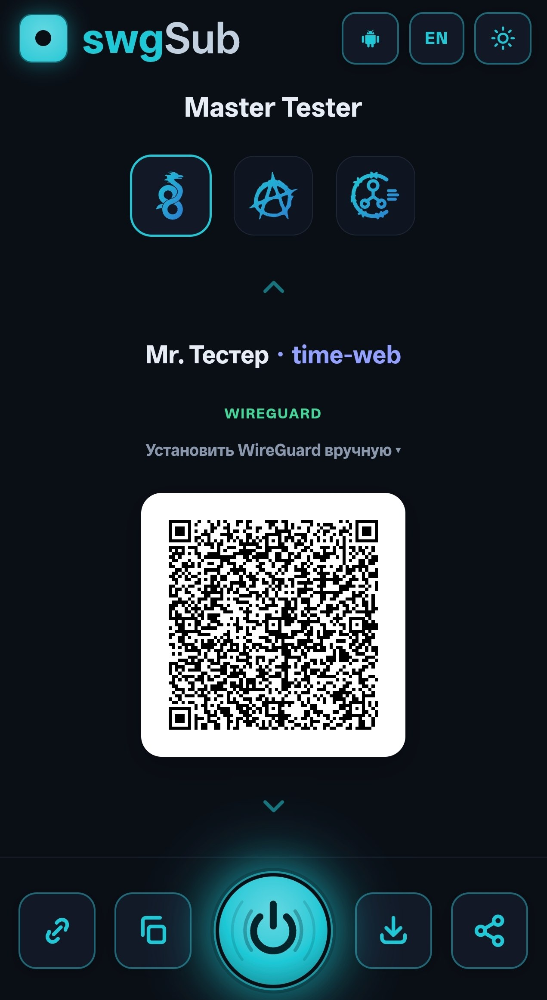
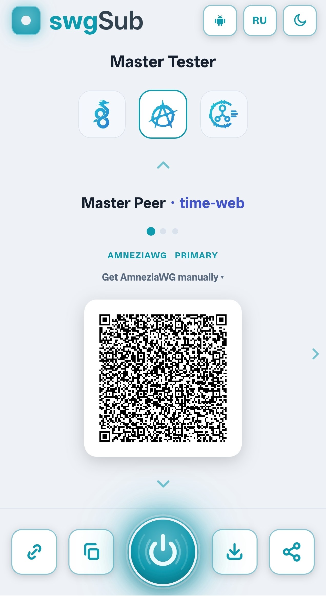
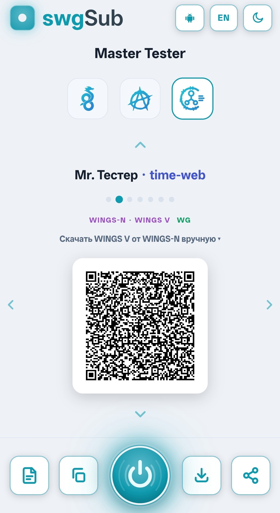
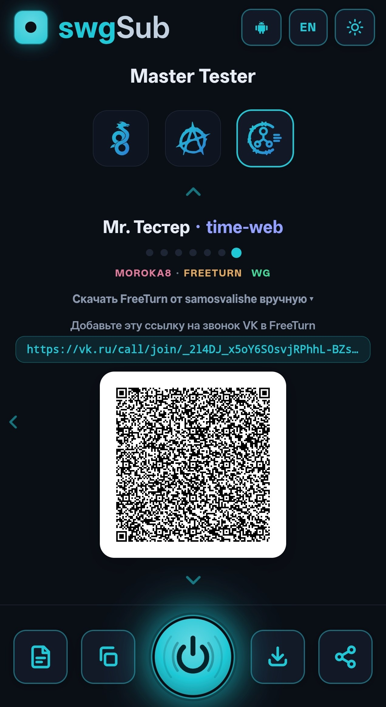
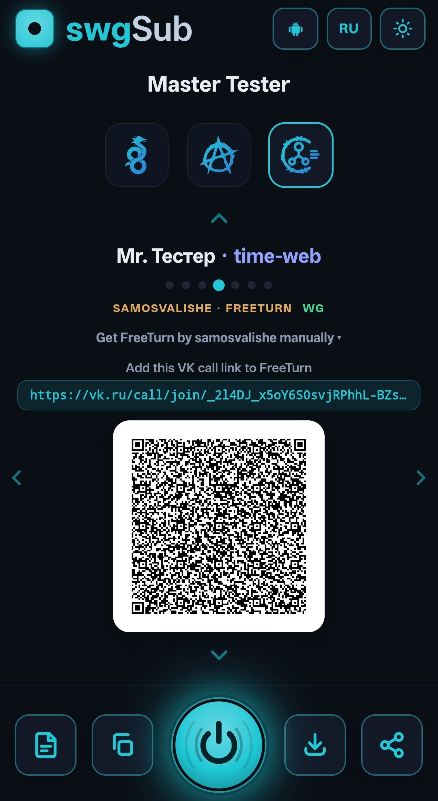
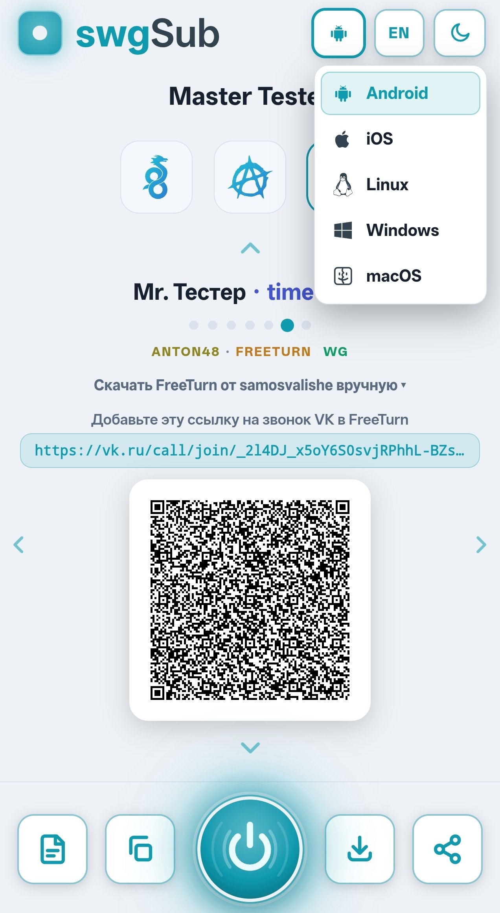
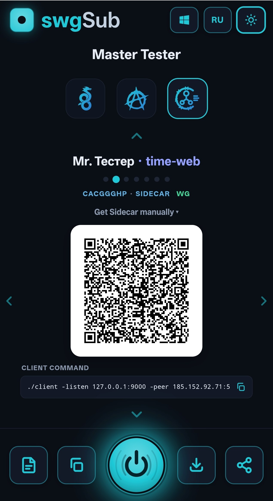

<p align="center"><a href="README.md">English</a> · <b>Русский</b> · <a href="README.technical.md">Technical (EN)</a> · <a href="README.technical.ru.md">Техническое (RU)</a></p>

<p align="center"><code>1.4.0-beta</code></p>

<!-- WHATS-NEW:START -->
> **Что нового в 1.4.0-beta** — [полный список изменений](CHANGELOG.ru.md)
> - **Восстановление пропавшего или сломанного интерфейса** — один клик пересоздаёт его с *теми же ключами* и возвращает всех пиров; если адрес пира вышел за пределы подсети, доступна кнопка **Исправить**. Работает по пиру или по всему узлу.
> - **Опциональное хранение ключей интерфейсов** — узлы запечатывают свои серверные ключи в хранилище, доступное только вам, поэтому стёртый узел можно пересобрать, а панель никогда не видит приватный ключ.
> - **Исправления** — переключение reverse-proxy с подпутём на встроенный HTTPS (и обратно) без потери узлов; адрес пира проверяется по подсети перед применением; конвертация Docker↔bare-metal сохраняет адрес и настройки.
<!-- WHATS-NEW:END -->

---

# swgPanel

**Простая в использовании самостоятельно разворачиваемая панель управления WireGuard и AmneziaWG с поддержкой TURN-PROXY. Разверните свой собственный VPN за считанные минуты.**

swgPanel — это панель управления для запуска собственного VPN на WireGuard / AmneziaWG на одном или
нескольких серверах. Вы добавляете своих пользователей прямо в браузере, выдаёте им QR-код — и они подключены.
Всё — у кого есть доступ, какими серверами они пользуются, сколько трафика расходуют — находится на одной
панели, которую вы размещаете сами.

Запустите её для себя, для своей семьи, для команды или для целого сообщества — быстрый приватный VPN без
ежемесячной подписки и без посторонних, сидящих посреди вашего трафика.

> Это полное руководство простым языком — его достаточно, чтобы установить swgPanel и пользоваться ею,
> даже если вы не технический специалист. Если же вы *технический* специалист и хотите разобраться во
> внутреннем устройстве — архитектуре, каждом флаге, API, безопасности — читайте
> **[Техническое руководство](README.technical.md)**.

<p align="center">
  <a href="screenshots/overview.png"></a>
  <a href="screenshots/flow-map.png"></a>
  <a href="screenshots/distribution.png"></a>
  <a href="screenshots/live-users.png"></a>
  <a href="screenshots/top-charts.png"></a>
  <a href="screenshots/node.png"></a>
</p>

<p align="center"><sub>Нажмите на плитку, чтобы увеличить · больше скриншотов по ходу руководства</sub></p>

## Содержание

- [Что она умеет](#что-она-умеет)
- [Прежде чем начать](#прежде-чем-начать)
- [Три роли (простыми словами)](#три-роли-простыми-словами)
- [Шаг 1 — Установите панель](#шаг-1--установите-панель)
- [Шаг 2 — Добавьте свои серверы](#шаг-2--добавьте-свои-серверы)
- [Шаг 3 — Добавьте пользователей и раздайте доступ](#шаг-3--добавьте-пользователей-и-раздайте-доступ)
- [Повседневное использование](#повседневное-использование)
- [Поддержание работы](#поддержание-работы) — обновления, резервные копии, восстановление, смена метода, удаление
- [Несколько вещей, которые стоит знать](#несколько-вещей-которые-стоит-знать)
- [Узнать больше](#узнать-больше)
- [Особая благодарность](#особая-благодарность)

## Что она умеет

- **Одна страница, чтобы управлять всем.** Добавляйте серверы, добавляйте пользователей, раздавайте доступ — всё из веб-панели.
- **Доступ в виде QR-кода.** Создайте человека, покажите ему QR — он сканирует его в приложении WireGuard/AmneziaWG. Никаких конфиг-файлов, которые нужно пересылать по почте.
- **Подписки — персональная ссылка для каждого пользователя.** Вместо разового QR каждый получает свою страницу **swgSub**: удобную для телефона ссылку с конфигом и QR для каждого сервера, где он есть — [WireGuard](screenshots/sub-wireguard.jpg), [AmneziaWG](screenshots/sub-amneziawg.jpg) и TURN-прокси-форки вроде [WINGS-N](screenshots/sub-wings-n.jpg), [samosvalishe](screenshots/sub-samosvalishe.jpg), [Moroka8](screenshots/sub-moroka8.jpg), [anton48](screenshots/sub-anton48.jpg) и других — плюс бейджи протокола/реле, светлая/тёмная тема и копирование / скачивание / отправка в одно касание. Ключ расшифровки живёт в `#fragment` ссылки, поэтому сервер хранит только шифротекст и никогда не видит чужие приватные ключи.
- **Приостановка доступа в один клик.** Заблокируйте человека — или только один из его серверов — мгновенно, не удаляя. Его туннели останавливаются, а страница подписки гаснет; разблокировка восстанавливает доступ с теми же ключами, ничего перевыпускать не нужно.
- **Смотрите, что происходит, в реальном времени.** Кто онлайн, сколько скачивают, какие серверы загружены — обновление каждые несколько секунд.
- **Один или несколько серверов.** Разместите серверы в разных странах; человек может переключаться между ними при сбое.
- **Панель на том же или отдельном сервере.** Запускайте панель на той же машине, что и VPN-узел, или на отдельном сервере, который только управляет узлами — как вам удобнее.
- **Трудно заблокировать.** Использует **AmneziaWG** (более скрытный WireGuard) и умеет ловко маршрутизировать
  трафик по назначению, поэтому продолжает работать там, где обычные VPN блокируются.
- **Turn-прокси уже встроены.** Интегрируется с ведущими серверами реле **vk-turn-proxy** и их клиентскими
  приложениями — оборачивайте трафик через TURN-реле VK/Yandex, чтобы обходить даже самые жёсткие блокировки, всё из панели.
- **Всё под вашим контролем.** Она размещается на ваших серверах, не хранит паролей и ключей, которые ей не нужны, и никуда не «звонит домой».

<details>
<summary>📸 <b>Больше скриншотов</b> — нажмите, чтобы раскрыть</summary>

| | |
|---|---|
| **Пользователи** — все, кому вы выдали доступ, одним взглядом |  |
| **Журнал активности** — каждое изменение и всё, что требует внимания |  |
| **Умная маршрутизация** — направляйте выбранные сайты через выбранный сервер |  |
| **Списки маршрутизации** — выберите режим маршрутизации и управляйте списками для каждого сервера |  |
| **Поставщики списков** — курируемые и общественные гео/доменные списки |  |
| **Turn-прокси** — оборачивайте трафик через реле, чтобы обходить блокировки |  |
| **Каталог turn-прокси** — какие форки реле предлагаются и автообновления |  |

**Страницы подписки** — персональная ссылка swgSub каждого пользователя, с конфигом и QR для каждого сервера (WireGuard, AmneziaWG и TURN-прокси-форки):

<p align="center">
  <a href="screenshots/sub-wireguard.jpg"></a>
  <a href="screenshots/sub-amneziawg.jpg"></a>
  <a href="screenshots/sub-wings-n.jpg"></a>
  <a href="screenshots/sub-moroka8.jpg"></a>
  <a href="screenshots/sub-samosvalishe.jpg"></a>
  <a href="screenshots/sub-anton48.jpg"></a>
  <a href="screenshots/sub-cacggghp.jpg"></a>
</p>

</details>

## Прежде чем начать

Вам нужен **один сервер**, на котором будет работать панель — дешёвого VPS (виртуального сервера) от любого
хостинг-провайдера более чем достаточно. У него должны быть:

- **Публичный IP-адрес** (чтобы ваши пользователи могли до него дотянуться).
- Свежий **Linux** (Ubuntu/Debian и большинство других подойдут).
- Доступ **`sudo`/root** и способ вставить в него команду (SSH).

Вот и всё. Если хотите доменное имя (вроде `vpn.example.com`), можете сначала направить его на сервер —
установщик автоматически получит для него настоящий сертификат HTTPS. Нет домена? Всё равно работает по
IP-адресу сервера.

Позже можно добавить **больше серверов** — каждый дополнительный сервер это ещё одна команда, запускаемая тем же способом.

## Три роли (простыми словами)

Каждый настраиваемый сервер играет одну из трёх ролей. Заучивать их не нужно — установщик спрашивает вас
простым языком, — но полезно знать эти слова:

- **Host** (хост) — *только панель управления.* Веб-страница и «мозг». Сама она не несёт VPN-трафика.
- **Master** (мастер) — *панель управления **и** VPN-сервер на одной машине.* Проще всего для установки на
  одном сервере: одна команда даёт вам панель и ваш первый VPN-сервер вместе.
- **Node** (нода) — *только VPN-сервер.* Дополнительный сервер, который несёт трафик и отчитывается вашей панели.

И есть **два способа** установить любую из них — выбирайте, что нравится:

- **Bare-metal** (напрямую на сервер) — устанавливается прямо на сервер (чуть быстрее).
- **Docker** — работает в контейнерах (аккуратно, легко переносить).

Их можно свободно смешивать: панель в Docker с bare-metal-серверами и так далее.

## Шаг 1 — Установите панель

Скопируйте команду на свой сервер и запустите её. Она **задаёт вам несколько простых вопросов** (это только
панель или ещё и VPN-сервер? какой домен? выберите пароль) и настраивает всё, включая HTTPS.

**Bare-metal:**
```
curl -fsSL https://raw.githubusercontent.com/SanityProtocol/swg-panel/main/bootstrap.sh | sudo bash -s host
```

**Docker:**
```
curl -fsSL https://raw.githubusercontent.com/SanityProtocol/swg-panel/main/bootstrap.sh | sudo bash -s docker host
```

Первый вопрос — о роли: выберите **Master**, чтобы сделать эту машину сразу и вашей панелью, *и* вашим первым
VPN-сервером (рекомендуется, если у вас всего один сервер), или **Host** — только для панели. В любом случае по
завершении она печатает веб-адрес вашей панели и данные для входа — откройте его и войдите.

> Предпочитаете установить Docker сами и использовать `docker compose`? Так тоже можно — смотрите
> [Техническое руководство](README.technical.md#docker).

## Шаг 2 — Добавьте свои серверы

Если выше вы выбрали **Master**, ваш первый VPN-сервер у вас уже есть — можете перейти к Шагу 3. Чтобы
добавить **больше** серверов (называемых **нодами**), сделайте для каждого следующее:

1. В панели откройте **Nodes → Add node** (Ноды → Добавить ноду). Она покажет вам готовую к вставке команду с
   уже вписанным ключом — одну для bare-metal, одну для Docker. Выглядит это так:

   ```
   curl -fsSL https://raw.githubusercontent.com/SanityProtocol/swg-panel/main/bootstrap.sh | sudo bash -s node        # bare-metal
   curl -fsSL https://raw.githubusercontent.com/SanityProtocol/swg-panel/main/bootstrap.sh | sudo bash -s docker node # Docker
   ```

2. Запустите эту команду на новом сервере. Она спрашивает адрес вашей панели и ключ (оба уже подставлены, если
   вы скопировали команду из панели), после чего сам подключается обратно к панели.

Новый сервер связывается с панелью сам — **вам никогда не нужно открывать к нему особый доступ**, никаких
входящих портов, никаких раздаваемых по кругу SSH-ключей. Через несколько секунд он появляется в вашем списке Nodes.

## Шаг 3 — Добавьте пользователей и раздайте доступ

1. Перейдите в **Peers → New peer** (Пиры → Новый пир), дайте ему имя (например, человека или устройства) и
   выберите, каким сервером (или серверами) он может пользоваться.
2. Панель покажет **QR-код и файл конфигурации**. Человек открывает приложение **WireGuard** или **AmneziaWG**
   на телефоне/компьютере, сканирует QR (или импортирует файл) — и он в сети.
3. Используете на этом сервере **turn-прокси**? Получить его конфигурацию так же просто — панель показывает
   адрес прокси и **wrap-ключ** для вставки в клиентское приложение vk-turn-proxy, прямо рядом с QR-кодом.

Вот и весь процесс. Секретная половина ключа создаётся в вашем браузере и показывается **один раз** — так что
сохраните/передайте конфигурацию тут же. Нужно дать тому же человеку второе устройство? Просто создайте ещё
один пир.

## Повседневное использование

- **Следите за панелью.** Страница **Overview** (Обзор) показывает, кто онлайн, самые загруженные серверы и
  куда идёт трафик — всё в реальном времени.
- **Добавляйте и удаляйте пользователей в любой момент.** Изменения доходят до серверов за считанные секунды. Удалите
  кого-то — и его доступ прекратится при следующей проверке связи.
- **Меняйте вход в панель** в **⚙︎ → Account** (Аккаунт) — вступает в силу немедленно. Там же включите **двухфакторную аутентификацию** (Google Authenticator) для более надёжного входа.
- **Направляйте определённые сайты через определённую страну (необязательно).** Например, отправляйте
  стриминг через сервер за границей, а всё остальное держите локально. Настраивается для каждого сервера в
  **Settings → Routing lists** (Настройки → Списки маршрутизации).
- **Обходите более жёсткие блокировки (необязательно).** Если в сети блокируется обычный VPN-трафик, swgPanel
  может обернуть его через **turn-прокси** — настраивается в деталях сервера и в **Settings → Turn proxies**
  (Настройки → Turn-прокси).
- **Питайте другие инструменты (необязательно).** Панель может делиться живым статусом с дашбордами вроде
  **Grafana** или **Uptime Kuma** и слать webhook, когда сервер уходит в офлайн — **Settings → Integrations**
  (Настройки → Интеграции).

## Поддержание работы

Всё, что ниже, — это **одна команда**, запускаемая на сервере тем же способом, что и при установке. Каждая
из них **спрашивает, прежде чем что-либо сделать**, и бережёт ваши данные.

### Обновление до последней версии

Запустите это на любом сервере (панель или VPN-сервер) — она сама разберётся, что установлено, и обновит это
на месте, сохранив все ваши настройки и пользователей:
```
curl -fsSL https://raw.githubusercontent.com/SanityProtocol/swg-panel/main/bootstrap.sh | sudo bash -s update
```

### Резервные копии — автоматические и ручные

- **Автоматические.** Каждый раз, когда что-то меняется — вы добавляете человека, добавляете сервер, меняете
  настройку — панель пишет **резервную копию с меткой времени** этого файла прямо рядом с ним и хранит
  **последние несколько**. Если файл когда-нибудь повредится (плохое выключение, переполненный диск), панель
  **тихо восстановит самую свежую исправную копию сама** при следующем запуске. От вас ничего не требуется.
- **Ручные (всё равно рекомендуется).** Для копии вне сервера сохраните куда-нибудь в надёжное место папку
  состояния панели (`/var/lib/swg-panel`, где лежат ваши пользователи и серверы) — одной копии достаточно, чтобы
  пересобрать панель в другом месте.

### Восстановление / переустановка без потерь

- **Повторный запуск любого установщика безопасен.** Он замечает, что установка уже есть, и **сохраняет ваши
  данные** (вход, сертификат, пользователей, серверы) — удобно, если команда прервалась или чтобы поменять опцию.
- **Пересобираете VPN-сервер?** Запустите на нём помощник восстановления, и он найдёт оставшуюся личность
  сервера, чтобы тот вернулся в вашу панель **без повторной регистрации**:
  ```
  curl -fsSL https://raw.githubusercontent.com/SanityProtocol/swg-panel/main/bootstrap.sh | sudo bash -s recovery
  ```
- **Потеряли всю машину с панелью?** Верните сохранённую папку `/var/lib/swg-panel` на свежую установку — и
  ваши пользователи и серверы снова на месте; серверы переподключаются сами.

### Переключение между bare-metal и Docker

Передумали насчёт способа установки сервера? Можно **преобразовать** его на месте, сохранив всё. Просто
перезапустите установщик, попросив *другой* метод — он предложит **convert · keep · abort** (преобразовать ·
оставить · прервать):
```
curl -fsSL https://raw.githubusercontent.com/SanityProtocol/swg-panel/main/bootstrap.sh | sudo bash -s master         # → bare-metal
curl -fsSL https://raw.githubusercontent.com/SanityProtocol/swg-panel/main/bootstrap.sh | sudo bash -s docker master  # → Docker
```
Он полностью готовит новую версию **прежде**, чем удалить старую, поэтому переключение занимает лишь несколько
секунд, и ваши пользователи едва его заметят. (Машину-«мастер» можно преобразовать целиком, либо только её половину с
панелью, либо только её серверную половину.)

### Удаление

Удаляет swgPanel, спрашивая про **каждую часть** отдельно (панель, VPN-сервер, VPN-программу, любые
turn-прокси) — ничего не удаляется без вашего согласия, и вы можете сохранить данные пользователей/серверов для
будущей переустановки:
```
curl -fsSL https://raw.githubusercontent.com/SanityProtocol/swg-panel/main/bootstrap.sh | sudo bash -s uninstall
```

## Несколько вещей, которые стоит знать

- **Вы решаете, насколько это приватно.** Ключи человека всегда создаются в вашем браузере. **По умолчанию**
  панель хранит копию каждой конфигурации (в которую входит секретный ключ), чтобы вы могли снова показать её
  QR-код или выдать её позже. Хотите вместо этого максимум приватности? Переключите **одну настройку** —
  **Settings → Client configs → off** (Настройки → Конфигурации клиентов → выкл) — и панель будет хранить
  только публичные части (публичный ключ, адрес, предварительный ключ); секретный ключ тогда показывается
  **один раз** и нигде не хранится.
- **Сбой никого не заблокирует.** Если панель ненадолго недоступна, ваши серверы продолжают работать с уже
  имеющимся доступом и наверстают при следующей проверке связи.
- **Это ранняя стадия.** Это Beta — отлично для экспериментов и небольших установок, но пока не для чего-то критичного.

## Узнать больше

- **[Техническое руководство (английский)](README.technical.md)** — архитектура, каждая опция и флаг
  установки, Docker вручную, преобразование, умная маршрутизация, внешний API, резервные копии и безопасность,
  а также устранение неполадок.
- **[Русский](README.ru.md)** · **[Техническое (RU)](README.technical.ru.md)**

## Особая благодарность

swgPanel использует несколько прекрасных проектов с открытым исходным кодом — огромная благодарность их авторам.

**Форки turn-proxy** — оборачивают WireGuard/AmneziaWG через TURN-реле VK/Yandex, чтобы обходить жёсткие блокировки:

- [cacggghp/vk-turn-proxy](https://github.com/cacggghp/vk-turn-proxy) — оригинал
- [WINGS-N/vk-turn-proxy](https://github.com/WINGS-N/vk-turn-proxy) — ❤️
- [samosvalishe/free-turn-proxy](https://github.com/samosvalishe/free-turn-proxy)
- [Moroka8/vk-turn-proxy](https://github.com/Moroka8/vk-turn-proxy)
- [kiper292/vk-turn-proxy](https://github.com/kiper292/vk-turn-proxy)
- [anton48/vk-turn-proxy](https://github.com/anton48/vk-turn-proxy)

**Списки маршрутизации / гео-данные** — доменные и IP-списки, на которых работает умная маршрутизация:

- [MetaCubeX/meta-rules-dat](https://github.com/MetaCubeX/meta-rules-dat)
- [v2fly/domain-list-community](https://github.com/v2fly/domain-list-community)
- [Loyalsoldier/geoip](https://github.com/Loyalsoldier/geoip)
- [1andrevich/Re-filter-lists](https://github.com/1andrevich/Re-filter-lists)
- [blackmatrix7/ios_rule_script](https://github.com/blackmatrix7/ios_rule_script)

И, конечно, [WireGuard](https://www.wireguard.com/) и [AmneziaWG](https://github.com/amnezia-vpn/amneziawg-go).
